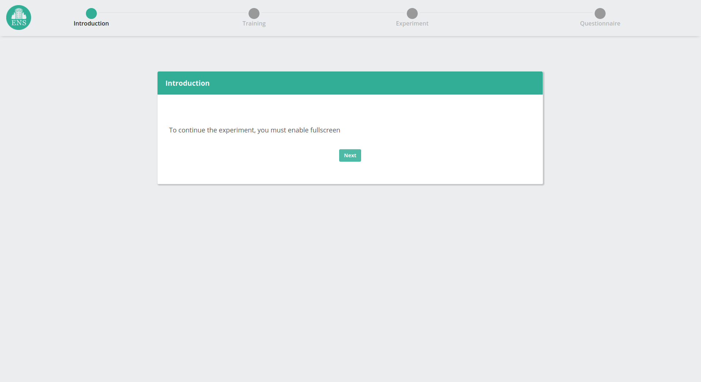
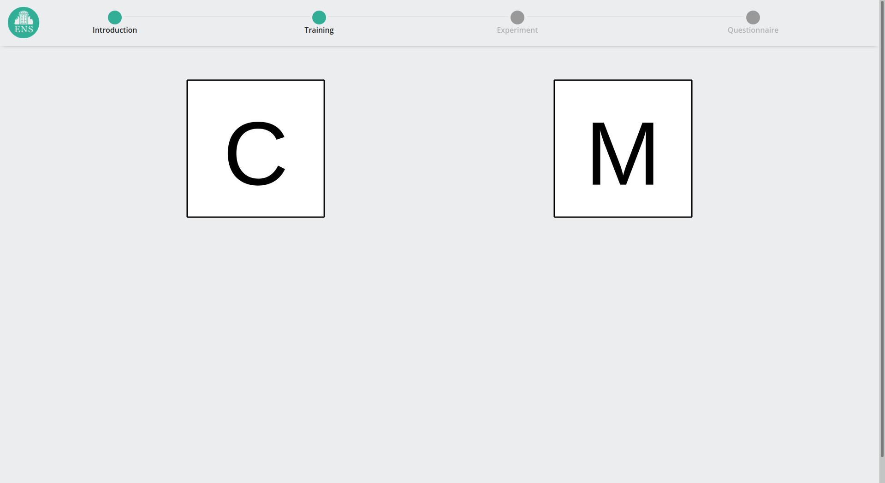
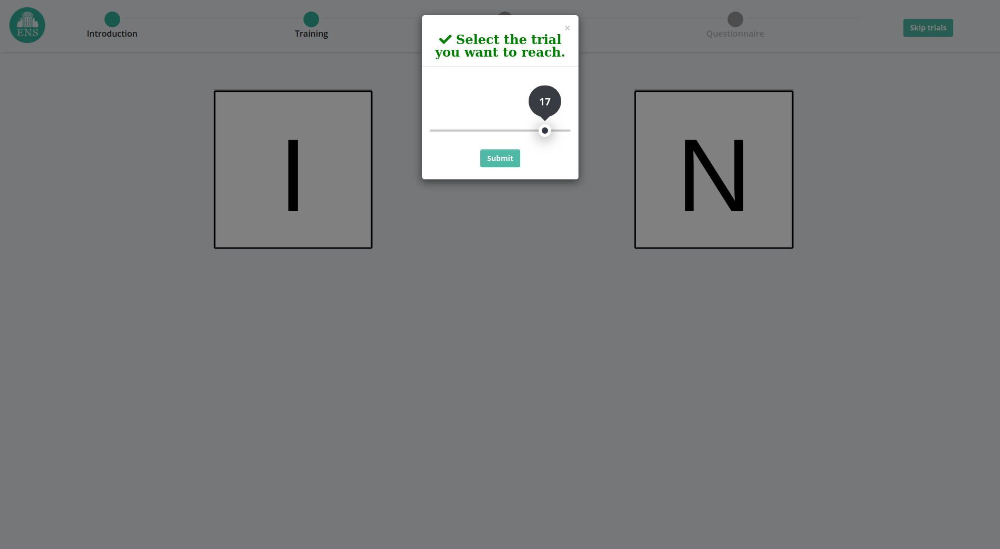

#  Retrieve And Compare

##  TO DO

* More coherent variable names

* Use modern php code for DB insertion [WIP]

* Improve smartphone layout (not centered)

* Replace strings additions by multiline strings 

 ```javascript       
let myNumber = 1;
let str = `this a  multine string,
           myNumber value is ${myNumber}`;
 ```
        
* design a simpler css code layout for option presentation

* Refactor inst.js

* Encapsulate Gui

* Remove what is hardcoded as much as possible (import instructions from json?)


## Screenshots

* Text panel + experiment timeline/stepper


* Bandit-task type choices


* Testing mode allowing to navigate through the experiment


